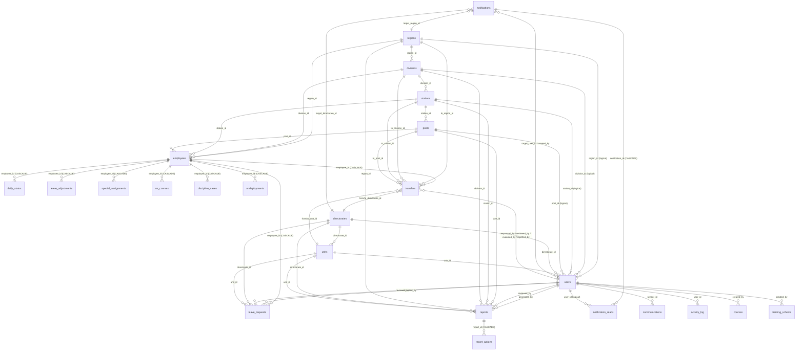

# Database Schema — UPF Human Resource Management System

**Engine:** SQLite (WAL mode, `PRAGMA foreign_keys = ON`)
**Database file:** `data/mdd.sqlite`
**Schema source of truth:** `includes/db.php` (`init_schema()` + `migrate()`, migrations v1 → v12)
**Current schema version:** 12 (`PRAGMA user_version`)

---

## 1. Conventions

| Convention | Meaning |
|---|---|
| `id INTEGER PRIMARY KEY AUTOINCREMENT` | Surrogate integer primary key |
| `TEXT` dates | `YYYY-MM-DD` unless the column ends in `_at`, which stores ISO-8601 (`date('c')`) or `datetime('now','localtime')` |
| `INTEGER` booleans | `0` / `1` (e.g. `active`, `auto_status`, `expiry_notified`) |
| `ON DELETE CASCADE` | Child rows are deleted with the parent (used for all employee-owned records and report actions) |
| `ON DELETE NO ACTION` (default) | FK enforced, delete of a referenced parent fails (SQLite default) |
| **No FK declared** | Relationship exists only at the application level (logical/orphan-prone) — flagged below as *logical* |

### Enumerated values (enforced by `CHECK` where marked ✅)

| Column | Values | CHECK? |
|---|---|---|
| `employees.gender` | `M`, `F` | ✅ |
| `daily_status.status` | `present`, `awol`, `leave`, `sick`, `suspended`, `disciplinary`, `on_duty`, `on_course`, `deserted`, `special_assignment`, `undeployed` | ✅ |
| `transfers.transfer_scope` | `hierarchy`, `directorate` | ✅ |
| `transfers.status` | `pending`, `approved`, `rejected`, `executed`, `cancelled` | ✅ |
| `transfers.report_status` | `pending`, `reported` | ✅ |
| `special_assignments.status` | `active`, `completed`, `cancelled` | ✅ |
| `on_courses.status` | `active`, `completed`, `withdrawn` | ✅ |
| `discipline_cases.case_type` | `suspension`, `disciplinary` | ✅ |
| `discipline_cases.status` | `open`, `closed`, `reinstated` | ✅ |
| `undeployments.status` | `active`, `redeployed` | ✅ |
| `users.role` | `superadmin`, `regional_commander`, `directorate_commander`, `division_commander`, `station_commander`, `unit_commander`, `post_commander`, `officer` | ❌ app-level (`includes/auth.php`) |
| `reports.status` | `submitted`, `reverted`, `pending_superadmin`, `pending_commander`, `approved`, `rejected` | ❌ app-level |
| `reports.scope_level` / `current_level` | `post`, `station`, `division`, `region`, `directorate`, `unit`, `hq` | ❌ app-level |
| `leave_requests.status` | `pending`, `approved`, `rejected` | ❌ app-level |
| `notifications.audience` | `all`, `user`, `role`, `region`, `directorate` | ❌ app-level |
| `notifications.kind` | `info`, `report`, `leave`, `transfer`, `course`, … | ❌ app-level |
| `communications.channel` | `email`, `sms` | ❌ app-level |
| `communications.status` | `pending`, `sending`, `sent`, `failed` | ❌ app-level |

---

## 2. Entity Relationship Diagram

---

## 3. Tables

### 3.1 Geographic / organizational hierarchy (legacy chain)

#### `regions`
| Column | Type | Constraints |
|---|---|---|
| id | INTEGER | PK AUTOINCREMENT |
| name | TEXT | NOT NULL, UNIQUE |
| code | TEXT | NOT NULL, UNIQUE |
| location | TEXT | |

#### `divisions`
| Column | Type | Constraints |
|---|---|---|
| id | INTEGER | PK AUTOINCREMENT |
| region_id | INTEGER | NOT NULL, FK → `regions.id` |
| name | TEXT | NOT NULL |
| code | TEXT | NOT NULL, UNIQUE |

#### `stations`
| Column | Type | Constraints |
|---|---|---|
| id | INTEGER | PK AUTOINCREMENT |
| division_id | INTEGER | NOT NULL, FK → `divisions.id` |
| name | TEXT | NOT NULL |
| code | TEXT | NOT NULL, UNIQUE |

#### `posts`
| Column | Type | Constraints |
|---|---|---|
| id | INTEGER | PK AUTOINCREMENT |
| station_id | INTEGER | NOT NULL, FK → `stations.id` |
| name | TEXT | NOT NULL |
| code | TEXT | NOT NULL, UNIQUE |

> Chain: `regions 1—* divisions 1—* stations 1—* posts` (strict 4-level cascade tree).

### 3.2 Functional organization (directorate / unit)

#### `directorates`
| Column | Type | Constraints |
|---|---|---|
| id | INTEGER | PK AUTOINCREMENT |
| name | TEXT | NOT NULL, UNIQUE |
| code | TEXT | NOT NULL, UNIQUE |
| description | TEXT | |
| active | INTEGER | NOT NULL DEFAULT 1 |

#### `units`
| Column | Type | Constraints |
|---|---|---|
| id | INTEGER | PK AUTOINCREMENT |
| directorate_id | INTEGER | NOT NULL, FK → `directorates.id` |
| name | TEXT | NOT NULL |
| code | TEXT | NOT NULL, UNIQUE |
| description | TEXT | |
| active | INTEGER | NOT NULL DEFAULT 1 |

> Note: uniqueness of `units (directorate_id, name)` is **not** enforced at DB level (only global `code` is UNIQUE).

### 3.3 Identity & access

#### `users`
| Column | Type | Constraints |
|---|---|---|
| id | INTEGER | PK AUTOINCREMENT |
| username | TEXT | NOT NULL, UNIQUE |
| password_hash | TEXT | NOT NULL (bcrypt) |
| full_name | TEXT | NOT NULL |
| role | TEXT | NOT NULL (see enum) |
| region_id | INTEGER | *logical* — no FK constraint |
| division_id | INTEGER | *logical* — no FK constraint |
| station_id | INTEGER | *logical* — no FK constraint |
| post_id | INTEGER | *logical* — no FK constraint |
| email | TEXT | (v5) |
| phone | TEXT | (v5) |
| directorate_id | INTEGER | FK → `directorates.id` (v10) |
| unit_id | INTEGER | FK → `units.id` (v12) |

> The four hierarchy scope columns define the user's **visibility scope** (`includes/auth.php` scope predicates). They are *logical* relationships only — the v2 migration recreated the table without `REFERENCES`.

### 3.4 Personnel

#### `employees`
| Column | Type | Constraints |
|---|---|---|
| id | INTEGER | PK AUTOINCREMENT |
| service_no | TEXT | NOT NULL, UNIQUE |
| full_name | TEXT | NOT NULL |
| gender | TEXT | NOT NULL, CHECK (`M`,`F`) |
| rank | TEXT | NOT NULL |
| region_id | INTEGER | FK → `regions.id` |
| division_id | INTEGER | FK → `divisions.id` |
| station_id | INTEGER | FK → `stations.id` |
| post_id | INTEGER | FK → `posts.id` |
| phone | TEXT | |
| active | INTEGER | NOT NULL DEFAULT 1 |
| email | TEXT | (v3) |
| directorate | TEXT | (v3) — **free text**, not FK |
| unit | TEXT | (v3) — **free text**, not FK |
| photo_path | TEXT | (v4) |
| annual_leave_days | INTEGER | NOT NULL DEFAULT 30 (v9) |

> Denormalized placement: `employees.directorate` / `employees.unit` duplicate the directorate/unit names as text and can drift from `directorates`/`units`.

#### `daily_status`
| Column | Type | Constraints |
|---|---|---|
| id | INTEGER | PK AUTOINCREMENT |
| employee_id | INTEGER | NOT NULL, FK → `employees.id` **ON DELETE CASCADE** |
| date | TEXT | NOT NULL |
| status | TEXT | NOT NULL, CHECK (11 values) |
| notes | TEXT | |
| recorded_by | INTEGER | FK → `users.id` |
| auto_status | INTEGER | NOT NULL DEFAULT 0 |
| — | — | **UNIQUE (employee_id, date)** |

**Index:** `idx_daily_status_date ON daily_status(date)`

### 3.5 Report workflow

#### `reports`
| Column | Type | Constraints |
|---|---|---|
| id | INTEGER | PK AUTOINCREMENT |
| post_id | INTEGER | FK → `posts.id` |
| station_id | INTEGER | FK → `stations.id` |
| division_id | INTEGER | FK → `divisions.id` |
| region_id | INTEGER | FK → `regions.id` |
| scope_level | TEXT | NOT NULL DEFAULT `'post'` |
| date | TEXT | NOT NULL |
| generated_by | INTEGER | FK → `users.id` |
| generated_at | TEXT | NOT NULL |
| summary_json | TEXT | NOT NULL (serialized payload) |
| status | TEXT | NOT NULL DEFAULT `'approved'` |
| reviewed_by | INTEGER | FK → `users.id` |
| reviewed_at | TEXT | |
| review_notes | TEXT | |
| current_level | TEXT | (v11) — where the report awaits review |
| revision | INTEGER | NOT NULL DEFAULT 0 (v11) |
| directorate_id | INTEGER | FK → `directorates.id` (v12) |
| unit_id | INTEGER | FK → `units.id` (v12) |

> Scope columns are populated according to `scope_level` (only the relevant level is set; others are NULL). Level chain: `post → station → division → region → hq` (or `directorate → unit` for functional commands).

#### `report_actions`
| Column | Type | Constraints |
|---|---|---|
| id | INTEGER | PK AUTOINCREMENT |
| report_id | INTEGER | NOT NULL, FK → `reports.id` **ON DELETE CASCADE** |
| action | TEXT | NOT NULL (submit / forward / approve / reject / revert …) |
| from_level | TEXT | |
| to_level | TEXT | |
| user_id | INTEGER | FK → `users.id` |
| notes | TEXT | |
| created_at | TEXT | DEFAULT `datetime('now','localtime')` |

**Index:** `idx_report_actions_report ON report_actions(report_id)`

### 3.6 Leave management

#### `leave_requests`
| Column | Type | Constraints |
|---|---|---|
| id | INTEGER | PK AUTOINCREMENT |
| employee_id | INTEGER | NOT NULL, FK → `employees.id` **ON DELETE CASCADE** |
| post_id | INTEGER | FK → `posts.id` |
| station_id | INTEGER | FK → `stations.id` |
| division_id | INTEGER | FK → `divisions.id` |
| region_id | INTEGER | FK → `regions.id` |
| leave_type | TEXT | NOT NULL DEFAULT `'Annual'` |
| start_date | TEXT | NOT NULL |
| end_date | TEXT | NOT NULL |
| reason | TEXT | NOT NULL |
| status | TEXT | NOT NULL DEFAULT `'pending'` |
| submitted_by | INTEGER | FK → `users.id` |
| submitted_at | TEXT | NOT NULL |
| reviewed_by | INTEGER | FK → `users.id` |
| reviewed_at | TEXT | |
| review_notes | TEXT | |
| destination | TEXT | (v11) |
| expiry_notified | INTEGER | NOT NULL DEFAULT 0 (v11) |
| directorate_id | INTEGER | FK → `directorates.id` (v12) |
| unit_id | INTEGER | FK → `units.id` (v12) |

#### `leave_adjustments`
| Column | Type | Constraints |
|---|---|---|
| id | INTEGER | PK AUTOINCREMENT |
| employee_id | INTEGER | NOT NULL, FK → `employees.id` **ON DELETE CASCADE** |
| days | INTEGER | NOT NULL (+ credit / − deduct) |
| reason | TEXT | NOT NULL |
| created_by | INTEGER | FK → `users.id` |
| created_at | TEXT | DEFAULT `datetime('now','localtime')` |

> Entitlement balance = `employees.annual_leave_days` + Σ `leave_adjustments.days` (− approved leave days). Computed at query time, not stored.

### 3.7 Personnel movements & assignments

#### `transfers`
| Column | Type | Constraints |
|---|---|---|
| id | INTEGER | PK AUTOINCREMENT |
| employee_id | INTEGER | NOT NULL, FK → `employees.id` **ON DELETE CASCADE** |
| transfer_scope | TEXT | NOT NULL DEFAULT `'hierarchy'`, CHECK (`hierarchy`,`directorate`) |
| from_region_id | INTEGER | *logical snapshot* — no FK |
| from_division_id | INTEGER | *logical snapshot* — no FK |
| from_station_id | INTEGER | *logical snapshot* — no FK |
| from_post_id | INTEGER | *logical snapshot* — no FK |
| to_region_id | INTEGER | FK → `regions.id` |
| to_division_id | INTEGER | FK → `divisions.id` |
| to_station_id | INTEGER | FK → `stations.id` |
| to_post_id | INTEGER | FK → `posts.id` |
| from_directorate_id | INTEGER | FK → `directorates.id` |
| from_unit_id | INTEGER | FK → `units.id` |
| to_directorate_id | INTEGER | FK → `directorates.id` |
| to_unit_id | INTEGER | FK → `units.id` |
| reason | TEXT | |
| transfer_date | TEXT | NOT NULL |
| effective_date | TEXT | NOT NULL |
| status | TEXT | NOT NULL DEFAULT `'pending'`, CHECK (5 values) |
| requested_by | INTEGER | FK → `users.id` |
| requested_at | TEXT | DEFAULT `datetime('now','localtime')` |
| reviewed_by | INTEGER | FK → `users.id` |
| reviewed_at | TEXT | |
| review_notes | TEXT | |
| executed_by | INTEGER | FK → `users.id` |
| executed_at | TEXT | |
| report_status | TEXT | NOT NULL DEFAULT `'pending'`, CHECK (`pending`,`reported`) (v10) |
| reported_by | INTEGER | FK → `users.id` (v10) |
| reported_at | TEXT | (v10) |
| report_notes | TEXT | (v10) |

> `from_*` hierarchy columns are historical snapshots (no FK) so past transfers survive hierarchy edits.

#### `special_assignments`
| Column | Type | Constraints |
|---|---|---|
| id | INTEGER | PK AUTOINCREMENT |
| employee_id | INTEGER | NOT NULL, FK → `employees.id` **ON DELETE CASCADE** |
| title | TEXT | NOT NULL |
| nature | TEXT | |
| place | TEXT | |
| start_date | TEXT | NOT NULL |
| end_date | TEXT | |
| status | TEXT | NOT NULL DEFAULT `'active'`, CHECK (`active`,`completed`,`cancelled`) |
| notes | TEXT | |
| created_by | INTEGER | FK → `users.id` |
| created_at | TEXT | DEFAULT `datetime('now','localtime')` |
| ended_at | TEXT | |
| end_remarks | TEXT | |

#### `undeployments`
| Column | Type | Constraints |
|---|---|---|
| id | INTEGER | PK AUTOINCREMENT |
| employee_id | INTEGER | NOT NULL, FK → `employees.id` **ON DELETE CASCADE** |
| reason | TEXT | NOT NULL |
| start_date | TEXT | NOT NULL |
| end_date | TEXT | |
| status | TEXT | NOT NULL DEFAULT `'active'`, CHECK (`active`,`redeployed`) |
| notes | TEXT | |
| created_by | INTEGER | FK → `users.id` |
| created_at | TEXT | DEFAULT `datetime('now','localtime')` |
| redeployed_at | TEXT | |

### 3.8 Training

#### `courses` (registry)
| Column | Type | Constraints |
|---|---|---|
| id | INTEGER | PK AUTOINCREMENT |
| name | TEXT | NOT NULL, UNIQUE |
| nature | TEXT | NOT NULL DEFAULT `'Professional'` |
| duration_days | INTEGER | |
| created_by | INTEGER | FK → `users.id` |
| created_at | TEXT | DEFAULT `datetime('now','localtime')` |

#### `training_schools` (registry)
| Column | Type | Constraints |
|---|---|---|
| id | INTEGER | PK AUTOINCREMENT |
| name | TEXT | NOT NULL, UNIQUE |
| place | TEXT | |
| created_by | INTEGER | FK → `users.id` |
| created_at | TEXT | DEFAULT `datetime('now','localtime')` |

#### `on_courses` (enrolments)
| Column | Type | Constraints |
|---|---|---|
| id | INTEGER | PK AUTOINCREMENT |
| employee_id | INTEGER | NOT NULL, FK → `employees.id` **ON DELETE CASCADE** |
| course_name | TEXT | NOT NULL — **free text**, not FK to `courses` |
| course_nature | TEXT | NOT NULL DEFAULT `'Professional'` |
| school | TEXT | — **free text**, not FK to `training_schools` |
| place | TEXT | |
| start_date | TEXT | NOT NULL |
| end_date | TEXT | NOT NULL |
| duration_days | INTEGER | |
| sponsor | TEXT | |
| status | TEXT | NOT NULL DEFAULT `'active'`, CHECK (`active`,`completed`,`withdrawn`) |
| notes | TEXT | |
| created_by | INTEGER | FK → `users.id` |
| created_at | TEXT | DEFAULT `datetime('now','localtime')` |
| completed_at | TEXT | |

> `on_courses.course_name` / `school` are *logical* references to the `courses` / `training_schools` registries.

### 3.9 Discipline

#### `discipline_cases`
| Column | Type | Constraints |
|---|---|---|
| id | INTEGER | PK AUTOINCREMENT |
| employee_id | INTEGER | NOT NULL, FK → `employees.id` **ON DELETE CASCADE** |
| case_type | TEXT | NOT NULL, CHECK (`suspension`,`disciplinary`) |
| case_ref | TEXT | |
| offence | TEXT | NOT NULL |
| start_date | TEXT | NOT NULL |
| end_date | TEXT | |
| status | TEXT | NOT NULL DEFAULT `'open'`, CHECK (`open`,`closed`,`reinstated`) |
| outcome | TEXT | |
| notes | TEXT | |
| created_by | INTEGER | FK → `users.id` |
| created_at | TEXT | DEFAULT `datetime('now','localtime')` |
| closed_at | TEXT | |

### 3.10 Notifications

#### `notifications`
| Column | Type | Constraints |
|---|---|---|
| id | INTEGER | PK AUTOINCREMENT |
| title | TEXT | NOT NULL |
| message | TEXT | NOT NULL |
| link | TEXT | |
| kind | TEXT | NOT NULL DEFAULT `'info'` |
| audience | TEXT | NOT NULL (`all`/`user`/`role`/`region`/`directorate`) |
| target_user_id | INTEGER | FK → `users.id` (when audience=`user`) |
| target_role | TEXT | (when audience=`role`) |
| target_region_id | INTEGER | FK → `regions.id` (when audience=`region`) |
| created_by | INTEGER | FK → `users.id` |
| created_at | TEXT | NOT NULL |
| target_directorate_id | INTEGER | FK → `directorates.id` (v10, when audience=`directorate`) |

#### `notification_reads` (composite PK)
| Column | Type | Constraints |
|---|---|---|
| notification_id | INTEGER | NOT NULL, part of PK, FK → `notifications.id` **ON DELETE CASCADE** |
| user_id | INTEGER | NOT NULL, part of PK — *logical* (no FK) |
| read_at | TEXT | NOT NULL |

---

### 3.11 Messaging, audit & configuration

#### `communications`
| Column | Type | Constraints |
|---|---|---|
| id | INTEGER | PK AUTOINCREMENT |
| subject | TEXT | NOT NULL |
| body | TEXT | NOT NULL |
| sender_id | INTEGER | FK → `users.id` |
| recipient_type | TEXT | NOT NULL DEFAULT `'all'` (polymorphic: `all`,`user`,`role`,`region`,`directorate`,…) |
| recipient_id | INTEGER | *logical* target id (polymorphic — no FK) |
| recipient_label | TEXT | snapshot of target label |
| channel | TEXT | NOT NULL DEFAULT `'email'` |
| sent_at | TEXT | NOT NULL |
| status | TEXT | NOT NULL DEFAULT `'pending'` |
| total_recipients | INTEGER | DEFAULT 0 |
| delivered | INTEGER | DEFAULT 0 |
| failed | INTEGER | DEFAULT 0 |
| error_log | TEXT | |

#### `activity_log`
| Column | Type | Constraints |
|---|---|---|
| id | INTEGER | PK AUTOINCREMENT |
| user_id | INTEGER | FK → `users.id` |
| user_name | TEXT | denormalized snapshot |
| action | TEXT | NOT NULL |
| entity_type | TEXT | *logical* (polymorphic) |
| entity_id | INTEGER | *logical* (polymorphic — no FK) |
| entity_label | TEXT | |
| details | TEXT | |
| ip_address | TEXT | |
| created_at | TEXT | NOT NULL DEFAULT `datetime('now','localtime')` |

#### `settings`
| Column | Type | Constraints |
|---|---|---|
| key | TEXT | PK |
| value | TEXT | |

Known keys: `smtp_host`, `smtp_port`, `smtp_user`, `smtp_pass`, `smtp_from_email`, `smtp_from_name`, `smtp_encryption`, `sms_provider`, `sms_api_key`, `sms_api_secret`, `sms_username`, `sms_sender_id`, `report_submission_mode`.

---

## 4. Complete foreign-key list

### 4.1 Enforced FKs (declared in the live schema)

| Child table | Column | Parent table | On delete |
|---|---|---|---|
| divisions | region_id | regions | NO ACTION |
| stations | division_id | divisions | NO ACTION |
| posts | station_id | stations | NO ACTION |
| units | directorate_id | directorates | NO ACTION |
| employees | region_id | regions | NO ACTION |
| employees | division_id | divisions | NO ACTION |
| employees | station_id | stations | NO ACTION |
| employees | post_id | posts | NO ACTION |
| users | directorate_id | directorates | NO ACTION |
| users | unit_id | units | NO ACTION |
| daily_status | employee_id | employees | **CASCADE** |
| daily_status | recorded_by | users | NO ACTION |
| leave_requests | employee_id | employees | **CASCADE** |
| leave_requests | post_id / station_id / division_id / region_id | posts / stations / divisions / regions | NO ACTION |
| leave_requests | directorate_id / unit_id | directorates / units | NO ACTION |
| leave_requests | submitted_by / reviewed_by | users | NO ACTION |
| leave_adjustments | employee_id | employees | **CASCADE** |
| leave_adjustments | created_by | users | NO ACTION |
| reports | post_id / station_id / division_id / region_id | posts / stations / divisions / regions | NO ACTION |
| reports | directorate_id / unit_id | directorates / units | NO ACTION |
| reports | generated_by / reviewed_by | users | NO ACTION |
| report_actions | report_id | reports | **CASCADE** |
| report_actions | user_id | users | NO ACTION |
| transfers | employee_id | employees | **CASCADE** |
| transfers | to_region_id / to_division_id / to_station_id / to_post_id | regions / divisions / stations / posts | NO ACTION |
| transfers | from_directorate_id / to_directorate_id | directorates | NO ACTION |
| transfers | from_unit_id / to_unit_id | units | NO ACTION |
| transfers | requested_by / reviewed_by / executed_by / reported_by | users | NO ACTION |
| special_assignments | employee_id | employees | **CASCADE** |
| special_assignments | created_by | users | NO ACTION |
| on_courses | employee_id | employees | **CASCADE** |
| on_courses | created_by | users | NO ACTION |
| discipline_cases | employee_id | employees | **CASCADE** |
| discipline_cases | created_by | users | NO ACTION |
| undeployments | employee_id | employees | **CASCADE** |
| undeployments | created_by | users | NO ACTION |
| notifications | target_user_id / created_by | users | NO ACTION |
| notifications | target_region_id | regions | NO ACTION |
| notifications | target_directorate_id | directorates | NO ACTION |
| notification_reads | notification_id | notifications | **CASCADE** |
| communications | sender_id | users | NO ACTION |
| activity_log | user_id | users | NO ACTION |
| courses | created_by | users | NO ACTION |
| training_schools | created_by | users | NO ACTION |

### 4.2 Logical relationships (no FK constraint — application-enforced only)

| Child table | Column(s) | Intended target | Risk |
|---|---|---|---|
| users | region_id, division_id, station_id, post_id | regions / divisions / stations / posts | orphaned scope values possible (v2 migration dropped the `REFERENCES`) |
| notification_reads | user_id | users.id | rows survive user deletion |
| communications | recipient_id (polymorphic) | users / roles / regions / directorates | target resolved via `recipient_type` |
| activity_log | entity_type + entity_id (polymorphic) | any entity | orphaned audit references |
| on_courses | course_name, school | courses.name, training_schools.name | renamed registry entries break matching |
| employees | directorate, unit (text) | directorates.name, units.name | denormalized — can drift from FK tables |
| transfers | from_region_id, from_division_id, from_station_id, from_post_id | regions / divisions / stations / posts | intentional historical snapshot |

---

## 5. Indexes

| Table | Index | Uniqueness | Columns |
|---|---|---|---|
| regions | sqlite_autoindex | UNIQUE | name; code |
| divisions | sqlite_autoindex | UNIQUE | code |
| stations | sqlite_autoindex | UNIQUE | code |
| posts | sqlite_autoindex | UNIQUE | code |
| directorates | sqlite_autoindex | UNIQUE | name; code |
| units | sqlite_autoindex | UNIQUE | code |
| users | sqlite_autoindex | UNIQUE | username |
| employees | sqlite_autoindex | UNIQUE | service_no |
| courses | sqlite_autoindex | UNIQUE | name |
| training_schools | sqlite_autoindex | UNIQUE | name |
| daily_status | sqlite_autoindex | UNIQUE | (employee_id, date) |
| notification_reads | sqlite_autoindex (PK) | UNIQUE | (notification_id, user_id) |
| settings | sqlite_autoindex (PK) | UNIQUE | key |
| daily_status | `idx_daily_status_date` | non-unique | (date) |
| report_actions | `idx_report_actions_report` | non-unique | (report_id) |

> Only two explicit `CREATE INDEX` statements exist in the whole schema; everything else relies on implicit unique autoindexes. High-traffic filters (`leave_requests.employee_id`, `transfers.status`, `activity_log.created_at`, `employees.*_id`) are **unindexed**.

---

## 6. Migration history

| Version | Change |
|---|---|
| v1 | Legacy `branches` schema marker (skipped) |
| v2 | `branches` → 4-level hierarchy (`regions/divisions/stations/posts`); rebuilt `users`, `employees`, `daily_status`, `reports`, `leave_requests` |
| v3 | `employees.email`, `.directorate`, `.unit` |
| v4 | `employees.photo_path`; `daily_status` CHECK + `deserted` |
| v5 | `users.email`, `.phone` |
| v6 | `settings`, `communications` |
| v7 | `activity_log` |
| v8 | `directorates`, `units` (+ seed data) |
| v9 | `special_assignments`, `on_courses`, `discipline_cases`, `undeployments`, `transfers`, `leave_adjustments`; `employees.annual_leave_days`; `daily_status` CHECK + `special_assignment`/`undeployed`; index `idx_daily_status_date` |
| v10 | `users.directorate_id`; `transfers.report_status/reported_*`; `notifications.target_directorate_id` |
| v11 | `reports.current_level`, `.revision`; `report_actions`; `leave_requests.destination`, `.expiry_notified`; `courses`; `training_schools` |
| v12 | `users.unit_id`; `reports.directorate_id`, `.unit_id`; `leave_requests.directorate_id`, `.unit_id`; functional commander accounts |

---

## 7. Known integrity caveats

1. **Orphans exist in the live DB** — `report_actions` ids 6–8 and `daily_status` id 367 reference missing parents; several migrations ran with `PRAGMA foreign_keys = OFF`, so `PRAGMA foreign_key_check` does not currently return clean.
2. **`users` scope columns lost their FKs** in the v2 table rebuild — dangling `region_id`/`division_id`/`station_id`/`post_id` values are not rejected.
3. **`employees.directorate`/`unit` are text**, duplicated from `directorates`/`units` — no referential integrity with the v12 `reports`/`leave_requests` FK columns.
4. **No unique constraint** on `units (directorate_id, name)`, nor on `special_assignments`/`undeployments` "one active row per employee" (enforced only in PHP).
5. **Polymorphic references** (`communications.recipient_id`, `activity_log.entity_id`, `notifications.target_role`) intentionally have no FK.
6. Migration v4 rebuilds `daily_status` with `INSERT OR IGNORE ... SELECT *` — column-order fragile if the base table ever diverges.
